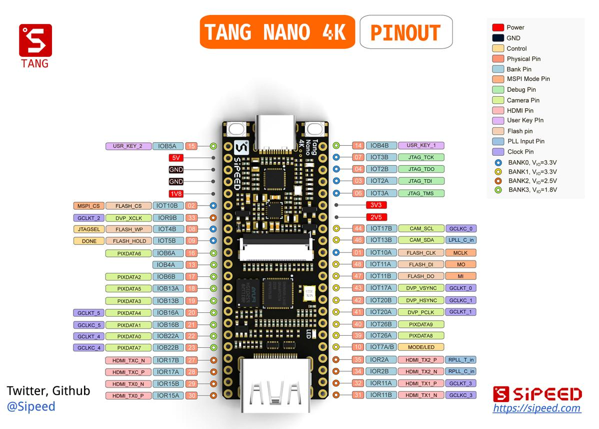
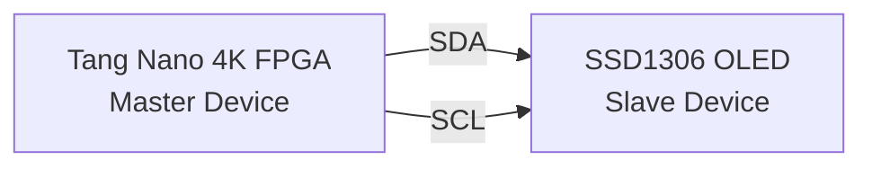

# FPGA-Based SSD1306 OLED Display Interface Using I²C Protocol on Tang Nano 4K


## Overview

This project demonstrates how to interface a **0.96" SSD1306 OLED Display** with the **Tang Nano 4K FPGA** using the **I²C (Inter-Integrated Circuit) communication protocol**.

The design implements a complete I²C Master Controller in Verilog, enabling the FPGA to communicate with the OLED display and render graphics, text, and patterns. The project serves as an introduction to FPGA-based peripheral communication and digital display control.

---

## Features

* I²C Master implemented in Verilog HDL
* SSD1306 OLED initialization sequence
* Text and graphics rendering support
* Fully FPGA-based solution
* Compatible with Tang Nano 4K Development Board
* Modular and reusable design architecture
* Educational implementation of the I²C protocol

---

#  Project Demonstration


---

#  Hardware Used

| Component    | Description                    |
| ------------ | ------------------------------ |
| Tang Nano 4K | Gowin FPGA Development Board   |
| SSD1306 OLED | 128×64 Monochrome OLED Display |
| USB-C Cable  | FPGA Programming               |
| Jumper Wires | Connections                    |
| Breadboard   | Optional                       |

---

# 🔍 About Tang Nano 4K



The Tang Nano 4K is a compact FPGA development board based on the **Gowin GW1NSR-4C FPGA**. It is widely used for learning digital design, FPGA development, and embedded hardware projects.

## Key Specifications

| Specification         | Value           |
| --------------------- | --------------- |
| FPGA                  | Gowin GW1NSR-4C |
| Logic Elements        | ~4608 LUT4      |
| Embedded RAM          | 288 Kbits       |
| DSP Blocks            | Available       |
| PLLs                  | Multiple        |
| Programming Interface | USB-C           |
| Operating Voltage     | 3.3V            |
| Development Tool      | Gowin EDA       |

### Why Tang Nano 4K?

* Affordable FPGA board
* Beginner-friendly
* Small form factor
* Excellent for digital design learning
* Supports Verilog and VHDL

---

# 🖥 About SSD1306 OLED Display


The SSD1306 is one of the most popular OLED display controllers used in embedded systems. Most modules provide a resolution of **128×64 pixels** and communicate through either SPI or I²C. The display commonly uses I²C address **0x3C**.

## Display Specifications


The SSD1306 contains internal Graphic Display RAM (GDDRAM) organized into pages and columns, allowing efficient display updates.

---

# 📡 Understanding the I²C Protocol

## What is I²C?
## 📊 SSD1306 Specifications

<p align="center">


</p>
I²C (Inter-Integrated Circuit) is a two-wire serial communication protocol developed for communication between integrated circuits.

Only two signals are required:

* SDA (Serial Data)
* SCL (Serial Clock)


---
##  I²C Communication Architecture
## 📡 FPGA ↔ OLED Communication



## I²C Transaction Sequence
## 📡 I²C Transaction Sequence

```mermaid
flowchart TD
    A([START])
    B[SLAVE ADDRESS]
    C[ACK]
    D[CONTROL BYTE]
    E[ACK]
    F[DATA BYTE(S)]
    G[ACK]
    H([STOP])

    A --> B
    B --> C
    C --> D
    D --> E
    E --> F
    F --> G
    G --> H
```

---

## Start Condition

The master initiates communication by pulling SDA low while SCL remains high.

```text
SCL ─────────────
SDA ──────\______
```

---

## Stop Condition

Communication ends when SDA transitions high while SCL is high.

```text
SCL ─────────────
SDA _____/───────
```

---

## ACK Mechanism

After every transmitted byte, the receiver sends an acknowledgment bit (ACK).

```text
Data Byte
10101010

ACK Bit
    ↓
10101010 0
```

---

## I²C Timing Diagram


---

# 🔗 OLED and FPGA Communication

The SSD1306 OLED receives commands and display data through the I²C bus.

## Step 1: FPGA Generates START Condition

```text
START
```

---

## Step 2: Send OLED Address

```text
0x3C
```

---

## Step 3: Send Control Byte

Control byte determines whether the next byte is:

* Command
* Display Data

---

## Step 4: Send Initialization Commands

Example:

```text
0xAE  -> Display OFF
0xA6  -> Normal Display
0xAF  -> Display ON
```

---

## Step 5: Send Pixel Data

Display memory receives pixel information from the FPGA.

```text
Page 0 → Pixel Data
Page 1 → Pixel Data
...
Page 7 → Pixel Data
```

The SSD1306 internally stores display information in a 1024-byte GDDRAM buffer.

---

# 📐 System Architecture

```text
+--------------------+
| Tang Nano 4K FPGA  |
|                    |
|  I2C Master        |
+---------+----------+
          |
          | SDA
          |
          | SCL
          |
+---------v----------+
| SSD1306 OLED       |
| Display Controller |
+--------------------+
```

---

# Project Structure

```text
Project/
│
├── top.v
├── i2c.v
├── i2c_api.v
├── gfx_unit_bresenham.v
├── README.md
│
└── images/
    ├── project_banner.png
    ├── tang_nano_4k.jpg
    ├── ssd1306_oled.jpg
    ├── oled_demo.jpg
    ├── i2c_bus.png
    └── i2c_timing.png
```

---

#  Pin Connections

| Tang Nano 4K | SSD1306 OLED |
| ------------ | ------------ |
| 3.3V         | VCC          |
| GND          | GND          |
| Pin 39       | SDA          |
| Pin 40       | SCL          |

---

#  Building the Project

1. Open Gowin EDA.
2. Create a new project.
3. Add all Verilog source files.
4. Configure pin assignments.
5. Synthesize the design.
6. Generate bitstream.
7. Program the FPGA.
8. Observe output on OLED display.

---

# Learning Outcomes

Through this project you will learn:

* FPGA design flow
* Verilog HDL
* I²C communication protocol
* SSD1306 display architecture
* Embedded hardware interfacing
* Digital system design

---

# References

* SSD1306 OLED Controller Datasheet
* Gowin Tang Nano 4K Documentation
* I²C Bus Specification
* Verilog HDL Documentation

---

#  Author

**Tejaswi Sahu**

FPGA and Embedded Systems Enthusiast

---

#  Support

If you found this project useful:

 Star the repository

 Fork the project

 Contribute improvements

 Share it with others

---

## License

This project is released under the MIT License.
