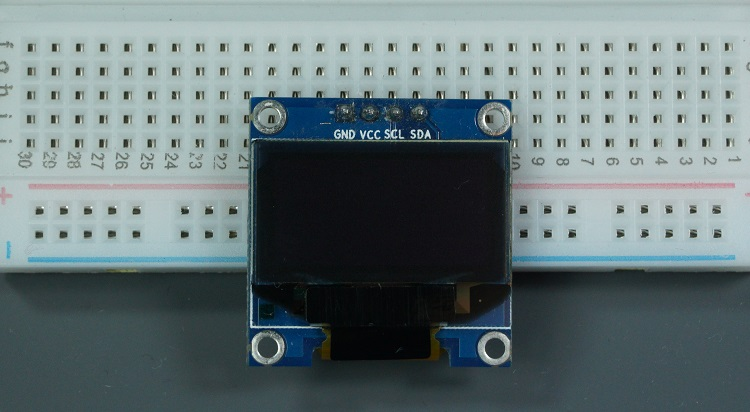

# FPGA-Based SSD1306 OLED Interface Using I²C on Tang Nano 4K

## Overview

This project demonstrates how to interface a 0.96" SSD1306 OLED display with the Tang Nano 4K FPGA using a custom I²C Master written entirely in Verilog HDL.

The design implements OLED initialization, command transmission, display data transfer, and basic graphics generation without using a microcontroller or soft-core processor. The project serves as a practical introduction to FPGA-based peripheral interfacing, digital communication protocols, and hardware graphics rendering.

---

## Features

- Custom I²C Master implemented in Verilog
- SSD1306 initialization sequence
- Hardware-driven OLED control
- Text and graphics rendering support
- Bresenham line-drawing engine
- Modular and reusable architecture
- Compatible with Tang Nano 4K FPGA
- Educational FPGA communication project

---

## Project Demonstration
image will be added soon


---

## Hardware Requirements

| Component | Description |
|------------|------------|
| Tang Nano 4K | Gowin FPGA Development Board |
| SSD1306 OLED | 128×64 Monochrome OLED |
| USB-C Cable | FPGA Programming |
| Jumper Wires | Signal Connections |
| Breadboard | Optional |

---

## Tang Nano 4K Platform


The Tang Nano 4K is built around the Gowin GW1NSR-LV4CQN48 FPGA and acts as the main controller in this project. It generates I²C timing, sends OLED commands, and transfers display data entirely in hardware.

### Key Specifications

| Feature | Value |
|----------|--------|
| FPGA | GW1NSR-LV4CQN48 |
| Logic Cells | ~4608 LUT4 |
| SRAM | 288 Kbits |
| PLLs | Available |
| HDL Support | Verilog / VHDL |
| Development Tool | Gowin EDA |
| Operating Voltage | 3.3V |

---

## SSD1306 OLED Display



The SSD1306 is one of the most commonly used monochrome OLED controllers. It contains internal display memory, timing circuitry, and OLED driver logic, allowing direct control through I²C.

### Display Specifications

| Parameter | Value |
|-----------|-------|
| Resolution | 128 × 64 |
| Color Depth | 1-bit Monochrome |
| Interface | I²C / SPI |
| GDDRAM | 1024 Bytes |
| I²C Address | 0x3C / 0x3D |
| Operating Voltage | 3.3V–5V |

---

## System Architecture


---

## Data Flow

1. User logic generates graphics data.
2. Graphics engine converts drawing operations into pixels.
3. I²C Master transmits commands and display data.
4. SSD1306 stores incoming bytes in GDDRAM.
5. Internal display drivers refresh the OLED panel.

---

## Physical Connections

| Tang Nano 4K | SSD1306 OLED |
|-------------|-------------|
| Pin 39 | SDA |
| Pin 40 | SCL |
| 3.3V | VCC |
| GND | GND |

---

## Clock Configuration

```text
27 MHz System Clock
        │
        ▼
   Clock Divider
        │
        ▼
 100 kHz I²C Clock
```

---

## I²C Communication

The FPGA operates as the I²C Master while the SSD1306 acts as the Slave device.

### Bus Signals

| Signal | Description |
|---------|-------------|
| SDA | Serial Data |
| SCL | Serial Clock |

### Communication Sequence


---

## START and STOP Conditions

### START

Generated when SDA transitions HIGH → LOW while SCL remains HIGH.

### STOP

Generated when SDA transitions LOW → HIGH while SCL remains HIGH.

---

## ACK Mechanism

After each transmitted byte, the receiver acknowledges successful reception by driving SDA LOW during the acknowledgment clock cycle.

---

## SSD1306 Memory Organization

The SSD1306 contains 1024 bytes of internal Graphic Display Data RAM (GDDRAM).

```text
Page 0 -> 128 Bytes
Page 1 -> 128 Bytes
Page 2 -> 128 Bytes
Page 3 -> 128 Bytes
Page 4 -> 128 Bytes
Page 5 -> 128 Bytes
Page 6 -> 128 Bytes
Page 7 -> 128 Bytes
```

```text
8 Pages × 128 Bytes = 1024 Bytes
```

Each byte controls a vertical column of 8 pixels.

---

## Initialization Sequence

Before displaying graphics, the FPGA sends an initialization sequence to configure the OLED controller.

Typical commands include:

```text
0xAE  Display OFF
0xD5  Set Clock Divide Ratio
0xA8  Set Multiplex Ratio
0xD3  Set Display Offset
0x8D  Enable Charge Pump
0x20  Set Addressing Mode
0xA1  Segment Remap
0xC8  COM Scan Direction
0x81  Contrast Control
0xAF  Display ON
```

---

## Graphics Engine

The project includes a hardware implementation of the Bresenham line-drawing algorithm.

Supported operations:

- Pixel plotting
- Character rendering
- Line drawing
- Bitmap rendering
- Frame-buffer based updates

---

## Advantages of FPGA Implementation

### Parallel Processing

The FPGA can perform:

- Graphics generation
- I²C communication
- Memory operations
- Display updates

simultaneously.

### Deterministic Timing

- Accurate I²C clock generation
- Reliable ACK detection
- No software latency
- Predictable behavior

### Scalability

The architecture can be extended to:

- Additional OLED displays
- SPI displays
- LCD modules
- Sensors and peripherals
- Larger graphics systems

---

## Project Structure

```text
.
├── top.v
├── i2c.v
├── i2c_api.v
├── gfx_unit_bresenham.v
├── README.md
└── images/
```

### Source Files

| File | Description |
|--------|------------|
| top.v | Top-level system integration |
| i2c.v | Low-level I²C Master |
| i2c_api.v | SSD1306 command/data interface |
| gfx_unit_bresenham.v | Hardware line-drawing engine |
| README.md | Project documentation |

---

## Building the Project

1. Open Gowin EDA.
2. Create a new project.
3. Add all Verilog source files.
4. Assign FPGA pins.
5. Run synthesis and place-and-route.
6. Generate the bitstream.
7. Program the Tang Nano 4K.
8. Verify OLED output.

---

## Learning Outcomes

This project helps develop practical experience with:

- FPGA Design Flow
- Verilog HDL
- I²C Protocol Implementation
- SSD1306 Display Architecture
- Digital Hardware Design
- Embedded Display Interfacing

---

## Future Improvements

Potential enhancements include:

- Hardware text engine
- Full frame buffer support
- Bitmap image rendering
- Font library integration
- SPI display support
- Animation and graphics acceleration

---

## References

- SSD1306 Datasheet
- Tang Nano 4K Documentation
- Gowin EDA Documentation
- NXP I²C Bus Specification

---

## Author

**Tejaswi Sahu**

FPGA & Embedded Systems Enthusiast

---

## License

Released under the MIT License.
