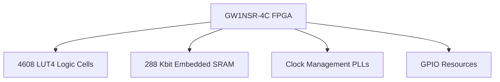
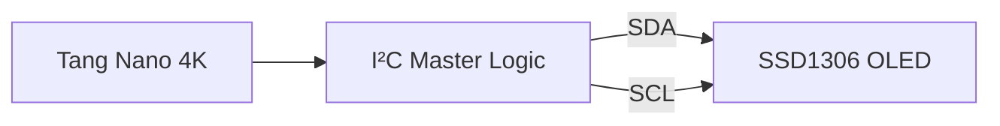
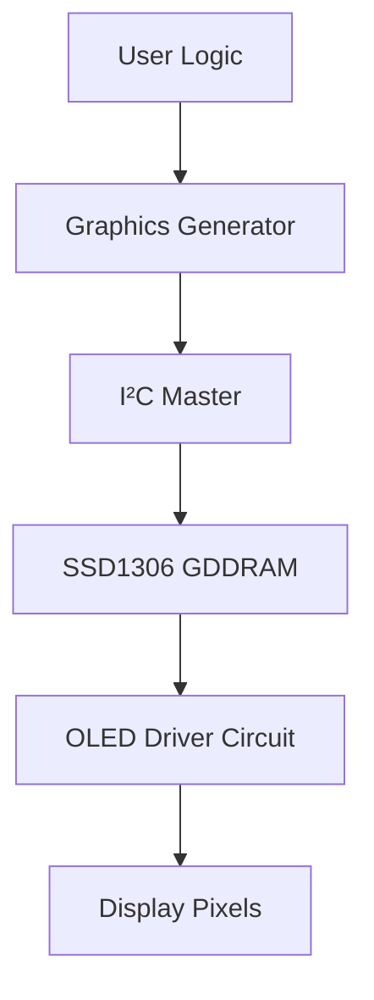
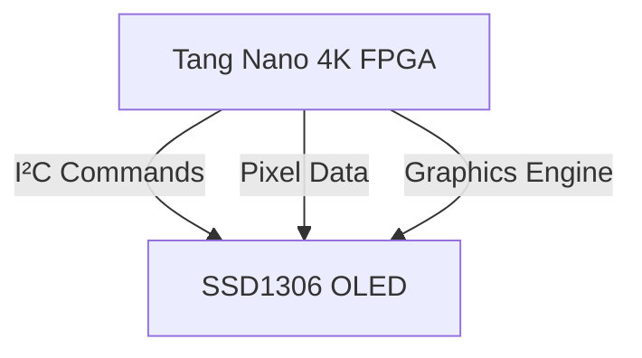
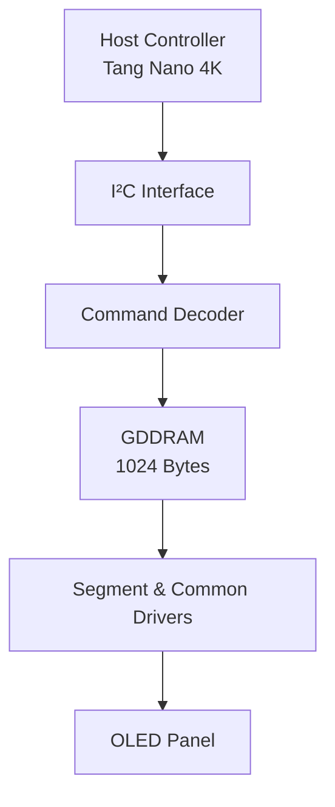
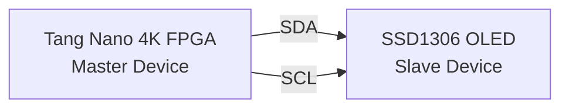
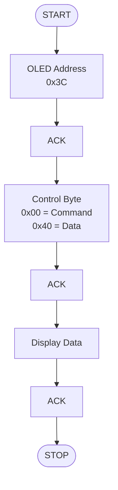
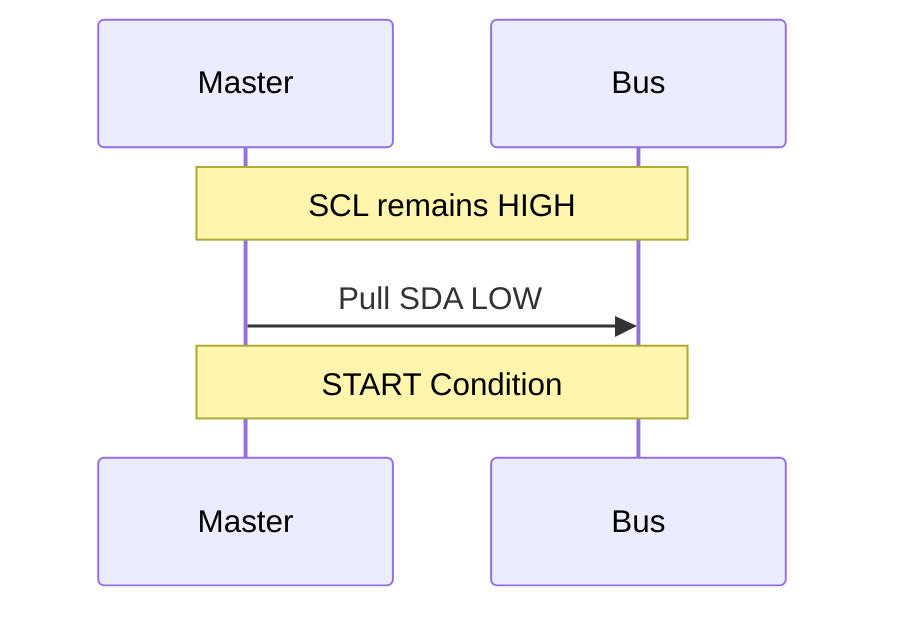
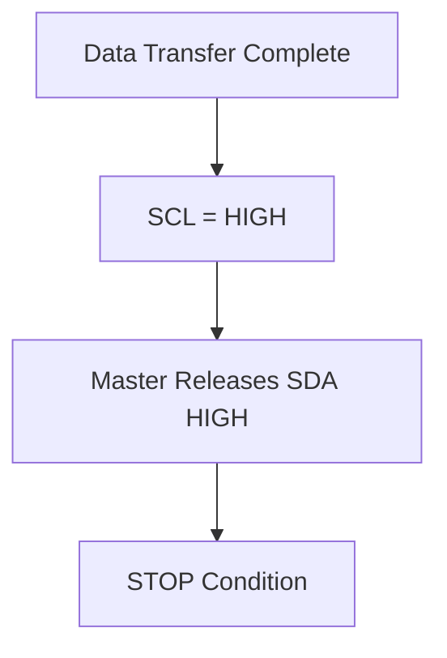
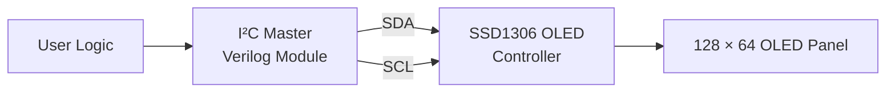

# FPGA-Based SSD1306 OLED Display Interface Using I²C Protocol on Tang Nano 4K


## Overview

This project demonstrates how to interface a **0.96" SSD1306 OLED Display** with the **Tang Nano 4K FPGA** using the **I²C (Inter-Integrated Circuit) communication protocol**.

The design implements a complete I²C Master Controller in Verilog, enabling the FPGA to communicate with the OLED display and render graphics, text, and patterns. The project serves as an introduction to FPGA-based peripheral communication and digital display control.

---

## Features

* I²C Master implemented in Verilog HDL
* SSD1306 OLED initialization sequence
* Text and graphics rendering support
* Fully FPGA-based solution
* Compatible with Tang Nano 4K Development Board
* Modular and reusable design architecture
* Educational implementation of the I²C protocol

---

#  Project Demonstration


---

#  Hardware Used

| Component    | Description                    |
| ------------ | ------------------------------ |
| Tang Nano 4K | Gowin FPGA Development Board   |
| SSD1306 OLED | 128×64 Monochrome OLED Display |
| USB-C Cable  | FPGA Programming               |
| Jumper Wires | Connections                    |
| Breadboard   | Optional                       |

---

#  About Tang Nano 4K


# Tang Nano 4K FPGA Platform


The Tang Nano 4K is a compact FPGA development board based on the **Gowin GW1NSR-LV4CQN48PC7/I6 FPGA**. In this project, the board serves as the primary processing unit responsible for generating the I²C protocol, initializing the SSD1306 controller, and transmitting graphical data to the OLED display.

Unlike microcontroller-based implementations, the communication logic is implemented entirely in **Verilog HDL**, allowing complete hardware-level control over the I²C bus timing and OLED interface.

---

## FPGA Specifications

| Feature           | Specification         |
| ----------------- | --------------------- |
| FPGA Device       | GW1NSR-LV4CQN48PC7/I6 |
| Logic Cells       | ~4608 LUT4            |
| Embedded SRAM     | 288 Kbits             |
| PLL Resources     | Multiple PLLs         |
| DSP Blocks        | Available             |
| GPIO Pins         | User Configurable     |
| Development Tool  | Gowin EDA             |
| HDL Support       | Verilog / VHDL        |
| Operating Voltage | 3.3V                  |

---

##  Tang Nano 4K Resource Overview



---

##  Role in This Project

The Tang Nano 4K performs the following functions:

### 1️ I²C Master Generation

The FPGA implements an I²C Master Controller capable of generating:

* START Conditions
* STOP Conditions
* Clock Pulses (SCL)
* Data Transmission (SDA)
* ACK Detection
* Bus Timing Control



---

### 2️ SSD1306 Initialization

After power-up, the FPGA sends a predefined command sequence to configure the OLED controller.

Example commands:

```text
0xAE  Display OFF
0xD5  Set Display Clock
0xA8  Multiplex Ratio
0x8D  Charge Pump Enable
0xAF  Display ON
```

These commands are stored and transmitted by FPGA logic without requiring a processor core.

---

### 3️ Graphics Processing

The FPGA generates pixel data that is written into the SSD1306 GDDRAM.

Supported operations include:

* Character rendering
* Pixel plotting
* Line drawing
* Frame buffering
* Bitmap display

The included Bresenham graphics engine is used to efficiently generate geometric primitives directly in hardware.

---
### Display Data Flow
The display rendering process begins within the FPGA's application or user logic, where graphical information such as text, symbols, geometric shapes, or custom bitmap data is generated. This information is passed to the graphics engine, which converts high-level drawing operations into pixel-level data suitable for display. In this project, graphics generation may include character rendering, pixel plotting, and line-drawing operations implemented using dedicated hardware modules.

Once the graphical data has been prepared, it is forwarded to the I²C Master Controller implemented within the Tang Nano 4K FPGA. The I²C controller packages the pixel information into a sequence of data bytes and transmits them over the SDA and SCL lines according to the I²C protocol. Upon reception, the SSD1306 controller stores the incoming bytes within its internal Graphic Display Data RAM (GDDRAM), which serves as a frame buffer for the OLED display.

The SSD1306 continuously reads the contents of GDDRAM and processes the stored pixel information through its internal display driver circuitry. This circuitry generates the required segment and common drive signals that control the OLED matrix. Finally, the processed data reaches the OLED panel, where individual pixels are illuminated according to the contents of GDDRAM, producing the visible text and graphics displayed on the screen. This complete data path—from user logic to graphics generation, I²C transmission, memory storage, display driving, and pixel illumination—forms the foundation of the FPGA-based OLED rendering system implemented in this project.



---

##  Physical Connections
The SSD1306 communicates with the Tang Nano 4K using only two signal lines.

| Tang Nano 4K | SSD1306 OLED |
| ------------ | ------------ |
| Pin 39       | SDA          |
| Pin 40       | SCL          |
| 3.3V         | VCC          |
| GND          | GND          |

---

##  Clock Generation

The Tang Nano 4K uses its internal clock resources to derive the I²C bus frequency.

Typical configuration:

```text
System Clock : 27 MHz

↓

Clock Divider

↓

I²C Clock : 100 kHz
```

This ensures compliance with standard-mode I²C timing requirements.

---
### Parallel Hardware Execution

The FPGA can simultaneously perform:

* Graphics calculations
* Memory management
* I²C communication
* Display refresh logic

without software interrupts or CPU scheduling.

---

### Deterministic Timing

I²C timing is generated directly by hardware state machines.

Benefits:

* Precise clock generation
* Reliable ACK detection
* No software latency
* Improved protocol compliance

---

### Scalability

The same architecture can be extended to:

* Multiple OLED displays
* SPI Displays
* LCD Controllers
* Sensors
* EEPROM Devices
* Complex Graphics Systems

simply by modifying the HDL design.

---

##  Tang Nano 4K as an Embedded Graphics Controller

In this project, the Tang Nano 4K effectively acts as a dedicated graphics controller:



This architecture demonstrates how modern FPGAs can directly interface with display hardware while maintaining complete control over communication timing, graphics generation, and display management.

---

#  About SSD1306 OLED Display


##  SSD1306 OLED Display Controller


The SSD1306 is a highly integrated **CMOS OLED/PLED driver IC** designed for monochrome graphical displays. It integrates display RAM, timing generation circuitry, charge pump circuitry, and display control logic into a single chip, making it one of the most widely used OLED controllers in embedded systems.

The controller is capable of driving displays with resolutions up to **128 × 64 pixels** and supports both **I²C** and **SPI** communication interfaces.

---

## Technical Specifications

| Parameter                | Specification             |
| ------------------------ | ------------------------- |
| Controller IC            | SSD1306                   |
| Display Resolution       | 128 × 64 Pixels           |
| Color Depth              | 1-bit Monochrome          |
| Display Technology       | Passive Matrix OLED       |
| GDDRAM Size              | 1024 Bytes                |
| Communication Interface  | I²C / SPI                 |
| I²C Address              | 0x3C or 0x3D              |
| Operating Voltage        | 3.3V – 5V                 |
| Display RAM Organization | 8 Pages × 128 Columns     |
| Internal Oscillator      | Integrated                |
| Charge Pump              | Integrated                |
| Refresh Control          | Internal Timing Generator |

---

## Internal Architecture



---

##  Graphic Display Data RAM (GDDRAM)

The SSD1306 contains an internal **Graphic Display Data RAM (GDDRAM)** that stores the display contents before they are rendered on the OLED panel.

### Memory Organization

```text
Page 0  -> 128 Bytes
Page 1  -> 128 Bytes
Page 2  -> 128 Bytes
Page 3  -> 128 Bytes
Page 4  -> 128 Bytes
Page 5  -> 128 Bytes
Page 6  -> 128 Bytes
Page 7  -> 128 Bytes
```

Total Memory:

```text
8 Pages × 128 Bytes = 1024 Bytes
```

Each byte controls a vertical column of 8 pixels.

---

### Memory Mapping in the SSD1306

The SSD1306 uses a page-oriented memory architecture to manage the display contents. The 128×64 pixel screen is divided into eight pages, each containing 128 columns. Since each byte controls a vertical group of eight pixels, the complete display requires 128 × 8 = 1024 bytes of memory. During operation, the Tang Nano 4K FPGA transmits command and data bytes through the I²C interface to update specific locations within the SSD1306 GDDRAM. The display controller then reads the stored data and drives the corresponding segment and common outputs to illuminate the OLED pixels. Understanding this memory organization is essential when implementing custom graphics engines, frame buffers, text rendering, or pixel-level drawing algorithms in Verilog.

---

##  Internal Functional Blocks

### Segment Driver

Generates horizontal pixel data.

```text
SEG0 → SEG127
```

A total of 128 segment outputs drive the display columns.

---

### Common Driver

Generates row scanning signals.

```text
COM0 → COM63
```

A total of 64 common outputs drive the display rows.

---

### Charge Pump Circuit

The SSD1306 contains an internal charge pump that generates the higher voltages required by OLED pixels.

Benefits:

* No external OLED bias supply required
* Reduced component count
* Simplified PCB design

---

### Timing Generator

The internal timing generator handles:

* Row scanning
* Display refresh
* Frame synchronization
* Oscillator management

This significantly reduces processing overhead on the host FPGA.

---

## 📡 Communication with Tang Nano 4K
<p align="center">
  
</p>

In this project the Tang Nano 4K operates as the I²C Master while the SSD1306 acts as the I²C Slave.

Communication between the Tang Nano 4K FPGA and the SSD1306 OLED display is performed using the Inter-Integrated Circuit (I²C) protocol, where the FPGA operates as the I²C Master and the SSD1306 acts as the I²C Slave device. Every transaction on the bus follows a well-defined sequence that ensures reliable data transfer and synchronization between the two devices.

The communication process begins with the generation of a START condition, which is produced by the FPGA by transitioning the SDA (Serial Data) line from a logic HIGH state to a logic LOW state while the SCL (Serial Clock) line remains HIGH. This unique bus event signals all devices connected to the I²C bus that a new transaction is about to begin and that the bus is now under the control of the master device.

Immediately following the START condition, the FPGA transmits the 7-bit slave address assigned to the SSD1306 display. In most OLED modules, this address is configured as 0x3C, although some variants may use 0x3D depending on the hardware configuration. Along with the address, a Read/Write bit is transmitted to indicate the direction of communication. Since the FPGA is writing commands and graphical data to the display, the write operation is selected.

After receiving its address, the SSD1306 responds with an ACK (Acknowledgment) bit. During this clock cycle, the display controller actively pulls the SDA line LOW, informing the FPGA that the address has been correctly recognized and that communication can continue. This acknowledgment mechanism is one of the key reliability features of the I²C protocol, ensuring that data is only transmitted when the receiving device is ready.

Once the address phase has been completed, the FPGA transmits a Control Byte, which informs the SSD1306 how the subsequent bytes should be interpreted. The control byte plays a critical role in the display initialization and rendering process. A control byte value of 0x00 indicates that the following bytes are command instructions intended for configuring the internal operation of the display controller. These commands may include settings such as multiplex ratio configuration, charge pump activation, contrast adjustment, display offset selection, addressing mode configuration, segment remapping, and COM scan direction control. Alternatively, a control byte value of 0x40 indicates that the subsequent bytes contain graphical display data that should be written directly into the SSD1306's internal Graphic Display Data RAM (GDDRAM).

Following transmission of the control byte, the SSD1306 generates another ACK signal to confirm successful reception. The FPGA then proceeds to transmit one or more Data Bytes, depending on the operation being performed. During initialization, these bytes represent configuration commands required to place the display into an operational state. During normal display operation, the data bytes correspond to pixel information that populates the SSD1306's internal memory structure.

The SSD1306 organizes display memory into a page-oriented architecture consisting of eight pages and 128 columns, resulting in a total GDDRAM capacity of 1024 bytes. Each transmitted data byte corresponds to a vertical group of eight pixels within a specific column. As data is written into GDDRAM, the display controller continuously scans the memory contents and updates the OLED panel using its internal segment and common driver circuitry. This mechanism allows text, geometric shapes, icons, bitmaps, and custom graphics generated by the FPGA to appear on the display.

After each transmitted byte, the SSD1306 provides an ACK signal to confirm successful reception. The FPGA continuously monitors these acknowledgment bits to detect communication errors, bus contention, or device unavailability. If an acknowledgment is not received, the transaction can be terminated or retried depending on the implementation of the I²C master controller.

Once all command or display data bytes have been transmitted, the FPGA generates a STOP condition to release the bus. The STOP condition is produced by transitioning the SDA line from LOW to HIGH while SCL remains HIGH. This event signifies the end of the current transaction and returns the bus to its idle state, allowing future communication cycles to occur.


---

## 🔧 SSD1306 Initialization Sequence

Before the SSD1306 OLED display can render text, graphics, or pixel data, it must first undergo a carefully defined initialization process. Upon power-up, the display controller enters a default state in which critical operating parameters such as memory addressing mode, multiplex ratio, contrast level, charge pump configuration, and display scanning direction have not yet been configured for the target hardware. To prepare the display for normal operation, the Tang Nano 4K FPGA transmits a sequence of command bytes over the I²C bus that configure the internal registers of the SSD1306 controller.

These initialization commands establish the display's electrical characteristics, memory organization, timing parameters, and pixel mapping behavior. Settings such as the multiplex ratio determine how the OLED rows are driven, while segment remapping and COM scan direction control the orientation of the displayed image. Additional commands enable the internal charge pump circuitry, configure contrast levels, and define the memory addressing mode used when writing graphical data to the display's GDDRAM. Only after this initialization sequence has been successfully completed can the OLED panel correctly interpret display data and illuminate pixels.

The following command sequence is executed by the FPGA during system startup to place the SSD1306 into a fully operational state and prepare it for graphical rendering.
Typical initialization commands:

```text
0xAE  Display OFF
0xD5  Set Clock Divide Ratio
0xA8  Set Multiplex Ratio
0xD3  Set Display Offset
0x40  Set Start Line
0x8D  Charge Pump Enable
0x20  Memory Addressing Mode
0xA1  Segment Remap
0xC8  COM Output Scan Direction
0xDA  COM Pins Hardware Config
0x81  Contrast Control
0xD9  Pre-Charge Period
0xDB  VCOMH Deselect Level
0xA4  Resume RAM Display
0xA6  Normal Display
0xAF  Display ON
```
---
#  Understanding the I²C Protocol

## What is I²C?
##  SSD1306 Specifications

<p align="center">


</p>
I²C (Inter-Integrated Circuit) is a two-wire serial communication protocol developed for communication between integrated circuits.

Only two signals are required:

* SDA (Serial Data)
* SCL (Serial Clock)


---
##  I²C Communication Architecture
## 📡 FPGA ↔ OLED Communication


##  SSD1306 OLED I²C Write Sequence


---
##  I²C START Condition


Communication ends when SDA transitions low while SCL is high.

##  I²C STOP Condition


Communication ends when SDA transitions low while SCL is high.

---

## ACK Mechanism

After every transmitted byte, the receiver sends an acknowledgment bit (ACK).

```text
Data Byte
10101010

ACK Bit
    ↓
10101010 0
```

---

## I²C Timing Diagram


---

# OLED and FPGA Communication

The SSD1306 OLED receives commands and display data through the I²C bus.

## Step 1: FPGA Generates START Condition

```text
START
```

---

## Step 2: Send OLED Address

```text
0x3C
```

---

## Step 3: Send Control Byte

Control byte determines whether the next byte is:

* Command
* Display Data

---

## Step 4: Send Initialization Commands

Example:

```text
0xAE  -> Display OFF
0xA6  -> Normal Display
0xAF  -> Display ON
```

---

## Step 5: Send Pixel Data

Display memory receives pixel information from the FPGA.

```text
Page 0 → Pixel Data
Page 1 → Pixel Data
...
Page 7 → Pixel Data
```

The SSD1306 internally stores display information in a 1024-byte GDDRAM buffer.

---

##  Overall System Architecture



---

# Project Structure


The project is organized into a modular architecture to separate hardware control, communication logic, graphics generation, and documentation. The main FPGA design is contained within `top.v`, which serves as the top-level module and integrates all submodules responsible for OLED communication and display control. The `i2c.v` file implements the low-level I²C protocol engine, handling SDA and SCL signaling, START and STOP conditions, data transmission, and acknowledgment detection. Building upon this, `i2c_api.v` provides a higher-level interface for sending commands and display data to the SSD1306 controller, simplifying communication between the application logic and the I²C hardware layer.

Graphics generation is handled by `gfx_unit_bresenham.v`, which implements the Bresenham line-drawing algorithm in hardware, enabling efficient rendering of geometric primitives directly on the OLED display. The project documentation is maintained in `README.md`, which contains detailed explanations of the hardware architecture, communication protocol, and implementation details.

An `images` directory is included to store visual resources used throughout the documentation. These assets include photographs of the Tang Nano 4K development board and SSD1306 OLED module, project demonstration images, I²C bus diagrams, timing waveforms, and other illustrations that help explain the system architecture and communication flow.

This modular organization improves code maintainability, readability, and scalability, making it easier to extend the design with additional graphics capabilities, display drivers, or communication interfaces in future developments.

###  Source Files Overview

- **top.v** – Top-level FPGA module responsible for integrating all system components.
- **i2c.v** – Low-level I²C Master implementation for SDA/SCL bus control.
- **i2c_api.v** – High-level SSD1306 communication interface and command handler.
- **gfx_unit_bresenham.v** – Hardware implementation of the Bresenham line-drawing algorithm.
- **README.md** – Project documentation and usage guide.
- **images/** – Documentation assets including diagrams, photographs, and project demonstrations.

The design follows a layered architecture in which application logic communicates with the SSD1306 display through dedicated graphics and I²C abstraction layers, improving modularity and simplifying future enhancements.
---

#  Pin Connections

| Tang Nano 4K | SSD1306 OLED |
| ------------ | ------------ |
| 3.3V         | VCC          |
| GND          | GND          |
| Pin 39       | SDA          |
| Pin 40       | SCL          |

---

#  Building the Project

1. Open Gowin EDA.
2. Create a new project.
3. Add all Verilog source files.
4. Configure pin assignments.
5. Synthesize the design.
6. Generate bitstream.
7. Program the FPGA.
8. Observe output on OLED display.

---

# Learning Outcomes

Through this project you will learn:

* FPGA design flow
* Verilog HDL
* I²C communication protocol
* SSD1306 display architecture
* Embedded hardware interfacing
* Digital system design

---

# References

* SSD1306 OLED Controller Datasheet
* Gowin Tang Nano 4K Documentation
* I²C Bus Specification
* Verilog HDL Documentation

---

#  Author

**Tejaswi Sahu**

FPGA and Embedded Systems Enthusiast

---

## License

This project is released under the MIT License.
